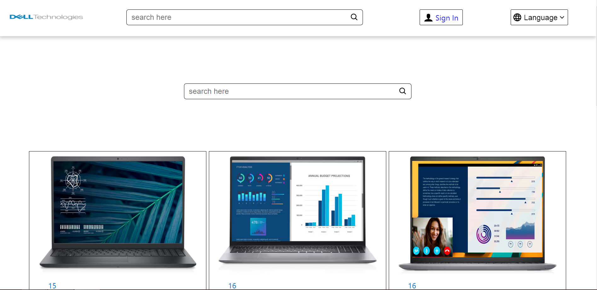
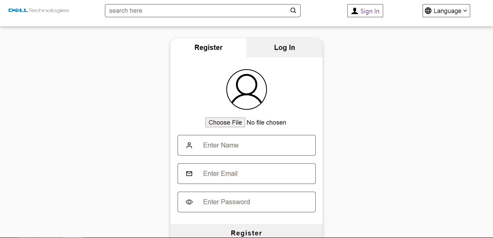
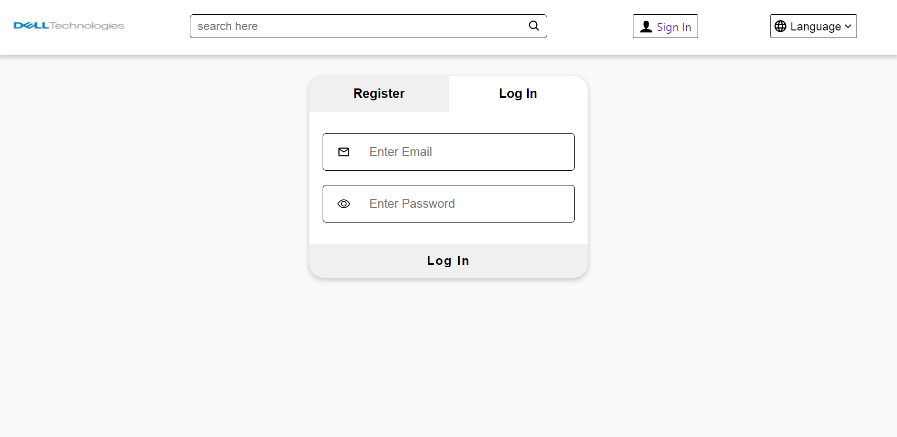
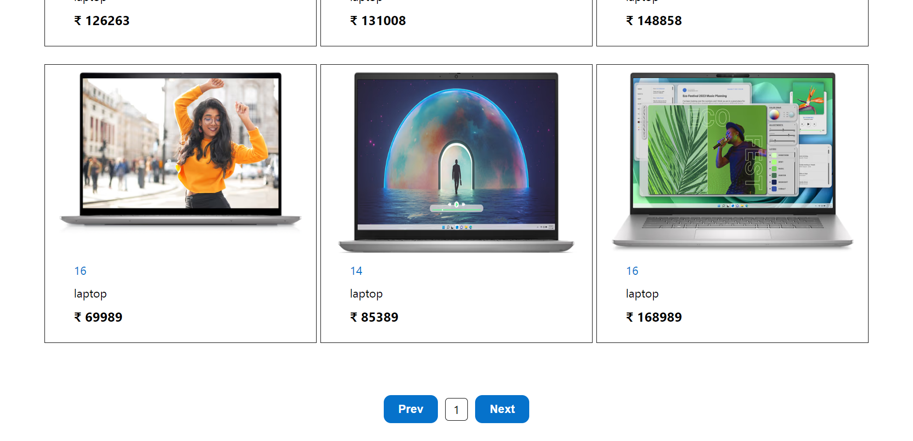
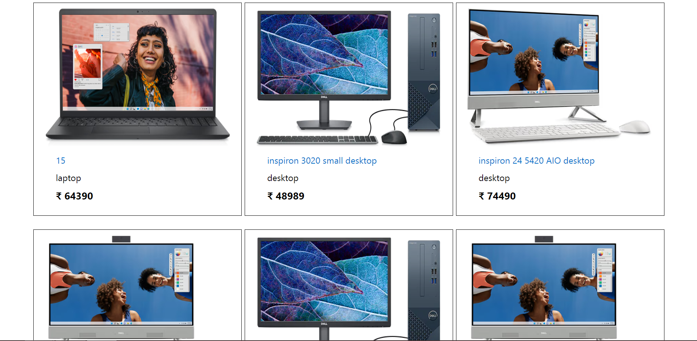

# DELL Company Assignment

User can see that the information about the dell products like models, configuration, specifications and other related things like compatibility.

**To see the live site click the below link.**

https://dell-company-assignment-frontend-api.vercel.app/

**To see the live backend, click below link.**

https://dell-company-assignment-backend-api-url.vercel.app

## Built with
<ul>
  <li>React js</li>
  <li>Redux</li>
  <li>HTML</li>
  <li>CSS</li>
  <li>JavaScript</li>
</ul>

## Used libraries
<ul>
  <li>node modules</li>
  <li>Styled-Components</li>
  <li>axios</li>
  <li>React Js</li>
  <li>React-Redux</li>
  <li>Redux</li>
  <li>Redux-Thunk</li>
  <li>React-router-dom</li>
  <li>React Icons</li>
</ul>

## Features
<ul>
  <li>Register/Login</li>
  <li>Responsive Website for mobiles, desktop and other devices.</li>
  <li>Able to see the products like desktop, laptop</li>
  <li>Search Functionality</li>
  <li>Pagination</li>
  <li>Authentication</li>
</ul>

## Some screenshots of the project

### Thanks for reading